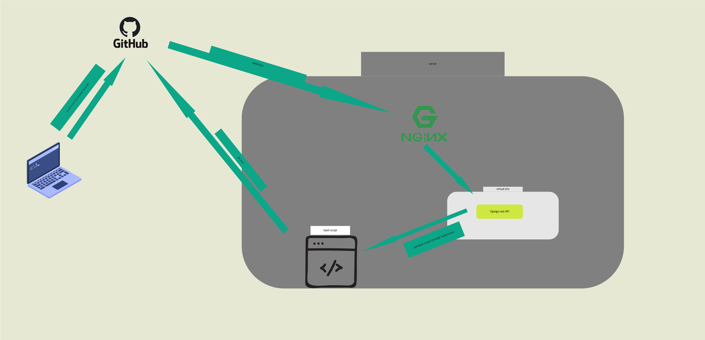
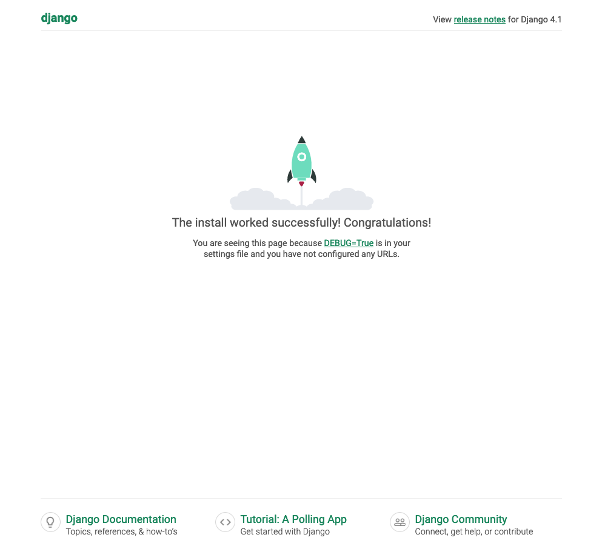
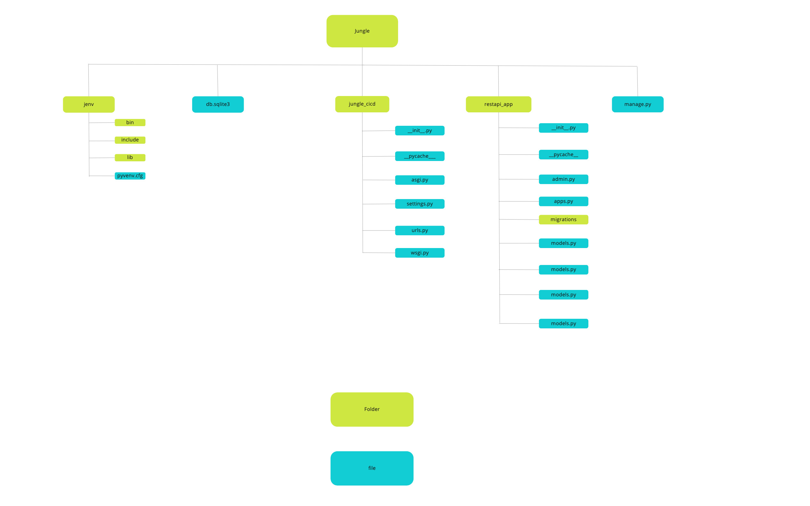

This is a workflow to update shiny dashboards running on shiny server set up.
The workflow gets triggered by a push event to the master branch, a webhook is then sent to a Django rest API which then calls a script to git pull the latest code.  

# Project set up

On your terminal, navigate to a location of your choice in your laptop and create a folder for your project, I called mine *jungle*, name yours as you desire. After you're done 
creating it, cd into it.

```
 mkdir jungle 
    cd jungle 
    
```
    

-   Create a virtual environment. This is crucial so that we can isolate our package dependencies local to the project.

```
python3 -m venv jenv 
    source jenv/bin/activate
    
```
       

-   Install Django and Django REST framework into the virtual environment

```
pip install Django==2.2 
    pip install djangorestframework
    
```
     

-   Set up a new project with single application, I named mine *jungle_cicd*.\
    Note the *.*, that simply means let the location of the project be where I am currently (inside jungle folder we created earlier).

```
django-admin startproject jungle_cicd .

```
       

Up until this point, if you ls your directory should have the contents listed below


```
$ls 

jenv jungle_cicd manage.py

```

### jenv

This is the virtual environment with the django and djangorestframework libraries we installed, of course all the libraries we'll install later will go here as well.

### manage.py

This is a command line utility for performing adminstrative tasks relating to a project, each time you start a django project its automatically created.

### jungle_cicd

This folder contains the project configuration files. Inside this folder you'll have;
```
    __init__.py   
    asgi.py    
    settings.py   
    urls.py  
    wsgi.py   
```
***init**.py* : This is an empty file that tells python interpreter that jungle_cicd is a python package.

*asgi.py* & *wsgi* : The use of either of this file(s) is at the deployment stage of your django project. Traditional web servers (i.e apache) do not understand or have a way to run 
python applications which thing made python community to come up with wsgi standard to bring about the connection/understanding between the web server and python web applications. The 
main difference between wsgi and asgi (the successor of wsgi) is its capability to allow multiple, asyncronous events per application. More about this on [this 
article](https://www.infoworld.com/article/3658336/asgi-explained-the-future-of-python-web-development.html).

*settings.py* : This file holds all the configuration values that your python web app needs for it to work properly; Base directory, location of static files, database settings, 
logging configurations, allowed hosts, installed apps and other stuff.

*urls.py* : This file contains the url configurations, the mappings between URL path expressions to Python functions (the views). Be default you'll have the URL pattern for the admin 
page, as for the other endpoints that you'll create you'll have to configure them on this file.

Before we move to the next step, its good to check if django is properly installed up until this point, we do that by calling the command below
```
  $ python manage.py runserver 
  
```
if you see the page below then we're good!



## Create an app

What we've done so far is to set up the project, now we need to create an application under our project. Django uses the concept of projects and apps for code management, as such, a 
Django project could contain one or more apps within it. Note: Apps are supposed to be portable for the sake of reusability.

Navigate into the project folder under which you have *jenv*, *jungle_cicd* and *manage.py* and run the below command.\
*Note: I assume your jenv* virtual environment is activated still.
```
$ python manage.py startapp restapi_app  

```

The *restapi_app* created should have the structure below
```
    restapi_app/
        __init__.py
        admin.py
        apps.py 
        models.py
        tests.py
        views.py 
        
```
Here's a brief explanation on the above files inside the app directory.

***init**.py* : As for the project folder, this is an empty file that tells python to handle this folder as a package.\
*admin.py* : this file makes it possible for the app to be modifiable in the Django adminstration interface.\
*apps.py* : You can configure the attributes for your app using this file.\
*models.py* : The application models are located here.\
*tests.py* : When you write unit tests for your application, this is where you place them.\
*views.py* : This is the location for the application views. They provide an interface through which a user interacts with a Django web application. A view can be function-based or 
class-based.

Below is an infographic showing an overview of the directory structure of our Django project.


## Additionals

You'll definitely create some more files and folders that are not listed above, the most common ones being:

#### Under the apps folders

*urls.py* : Initially its not there, but you have to include it. Its functionality is similar to the one in the project folder, mapping the user's url request to the respective 
endpoint.

#### Under the project directory

##### static directory

This can be located in the project root. It contains the static files of your project such as the css and javascript files and perhaps images.

##### Templates

This folder contains the HTML files, you can have it located in the project root but for each app, you will need to create its own template directory such that the common templates 
such as navbar and the footer are located in the template under the project root and the app specific ones going under the app templates.

##### Forms

In case your project expects some data in form of inputs from the users, you will need forms.py sitting under the project root directory.

Register the app (restapi_app in this case) in the project settings This is so that django can recognize the app

```
# Application definition

    INSTALLED_APPS = [
        'django.contrib.admin',
        'django.contrib.auth',
        'django.contrib.contenttypes',
        'django.contrib.sessions',
        'django.contrib.messages',
        'django.contrib.staticfiles',
        'rest_framework',
        'restapi_app',
    ]
    
```
    

Create an endpoint for our app Let's have our app respond with a *Hello world* text when poked on the *GET*. We do this on the views.py file under the restapi_app App.

```
    from django.shortcuts import render
    from rest_framework import Response
    from rest_framework.decorators import api_view

    # Create your views here.
    @api_view(['POST'])
    def gitpull(request):
        return Response("Hello World")
```
   
        

Create a url for the above endpoint For each view you create you have to create a url for it. This you do on the urls.py script of the app. The file is not initially available, as 
such, you have to create it.

```
    from django.urls import path
    from . import views
    from django.conf import settings

    urlpatterns = [
        path('', views.Greetings)
```
    
Register the app urls This is done on the urls.py of the project. *Note: remember to import the include* function from django.urls

```
    from django.contrib import admin
    from django.urls import path, include

    urlpatterns = [
        path('admin/', admin.site.urls),
        path('',include('restapi_app.urls'))
    ]
    
```
    

### Running system commands from the API

What we want to achieve with this API is to be able to run a git pull command from inside the directory containing our code base so that our shiny apps are automatically updated. This 
pipeline will be triggered by a push event to the master branch of the repo of interest then a webhook will be sent to the API. Instead of running the git pull commands directly from 
the API, we will create a bash script and call it from the API using python subprocess library. Below is the bash script that does the task.

### Environment variables

Its a good practice to store sensitive data away from easy reach. This could be authentication credentials for modules such as API keys or perhaps database if you're using one. Of 
course up until this point we haven't used any of that but I consider the paths to files as sensitive information, you definitely don't want to expose the pathways of your system to 
the public. Another advantage of using environment variables is to give you flexibility when deploying your project to production, you don't want to be editing the variable paths on 
production environment.

Having said that, let me do a brief on using environment variables. Create .env file in the same directory where manage.py resides and add the following key-value-pair variable.  

```
  SCRIPT_LOC='/path/to/your/script.sh'  
  
```
Next, install the django-environ library

```
  pip install python-dotenv  
  
```

Edit the views.py script under the respapi_app to as below

```
    from django.shortcuts import render
    from rest_framework.response import Response
    from rest_framework.decorators import api_view
    import subprocess
    from django.http import HttpResponse
    from dotenv import load_dotenv
    import os 

    load_dotenv()


    # Create your views here.
    @api_view(['POST'])
    def gitpull(request):
        process = subprocess.run([os.getenv("SCRIPT_LOC")])
        if process.returncode == 0:
            return HttpResponse("success")
        else:
            return HttpResponse("fail")
```

Run the API with the below command 

```
python manage.py runserver   

```

To try out if its working paste the address : *http://127.0.0.1:8000* on your browser and you'll see a response.
Alternatively you can poke the API from the terminal with the below commands

```
curl http://127.0.0.1:8000/ 

```

### nginx  
Its always advisable to have your server processes served through a reverse proxy (such as nginx) for security reasons. So what happens is you'll register the API in nginx and only 
open port 80/443 of the server, with that in place any call to the API will first of all hit nginx which will reverse proxy the request to the API. 


